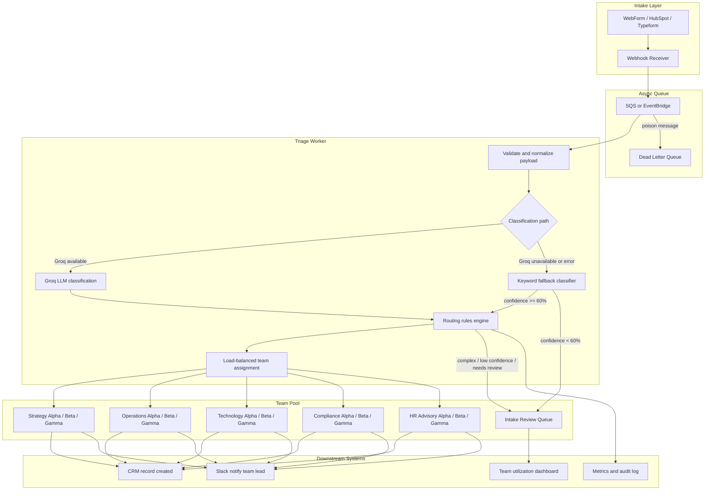

# Intake Triage Agent — Architecture

## Overview

This prototype automates the first step of professional services intake: classifying inbound enquiries by service line and complexity, enriching them with reasoning and tags, and routing them to the appropriate team. The design separates **semantic classification** (LLM or keyword fallback) from **business routing** (deterministic rules with load balancing), keeping the system auditable, override-friendly, and production-evolvable.

Three key design principles:
1. **LLM for semantics, code for routing** — the model never assigns team leads directly.
2. **Load-aware assignment** — each service line has multiple teams; routing picks the least busy one.
3. **Human review as a first-class queue** — not a dead end, but a tracked, measurable pipeline with its own capacity and SLA.

## High-Level Data Flow



## Classification Paths

The system has two classification paths with distinct behavior:

### LLM path (primary)
- Calls Groq (`llama-3.1-8b-instant`) with structured JSON output, temperature 0.
- System prompt defines 5 service lines, complexity rubric, and review triggers.
- 3 few-shot examples embedded in the user prompt for calibration.
- LLM self-reports confidence and sets `needsHumanReview` when uncertain.
- Validation via Zod schema; parse failures fall through to keyword path.

### Keyword fallback path
- Triggered when Groq is unavailable, times out (>15s), or returns invalid output.
- Scores each service line by keyword matches in the enquiry text.
- Confidence is capped at 65% (or 45% for ambiguous ties).
- **Auto-routes** when confidence > 60% — assigns to the least-loaded team.
- **Routes to human review** when confidence ≤ 60%, with the keyword-suggested service line, complexity, and confidence included in the reasoning field so the reviewer has a starting point.

## Load-Balanced Routing

Each of the 5 service lines has 3 teams (Alpha, Beta, Gamma), each with a team lead and a capacity rating. Routing works as follows:

1. Classification determines the **service line** and **complexity**.
2. `shouldRouteToIntakeReview` checks if the enquiry needs human review (low `needsHumanReview` flag, complex scope, or high-urgency moderate complexity).
3. If auto-routeable: `getLoadBalancedTeam(serviceLine)` picks the team with the **lowest utilization percentage** (weighted task load / max possible load).
4. The assignment is recorded against that team, updating its utilization for subsequent routing decisions.

### Intake Review Queue
The intake review queue (`intake-review@firm.com`) is tracked as a separate entity with its own capacity (15 slots) and load monitoring. Every enquiry routed to human review is recorded against it. The dashboard displays its utilization independently from the service-line teams, since it's a cross-cutting bottleneck.

### Utilization calculation
- Each task is weighted by complexity: simple=1, moderate=2, complex=3.
- Team utilization = `sum of task weights / (capacity × 3) × 100`, capped at 100%.
- The same utilization percentage drives both the routing decision and the dashboard display — no discrepancy between what the router sees and what the operator sees.

## Prototype vs Production

| Layer | Prototype (this repo) | Production target |
|-------|----------------------|-------------------|
| Intake | Next.js form UI | HubSpot / Typeform webhook |
| Processing | Synchronous API route | Async worker (Lambda, Cloud Run, or queue consumer) |
| Classification | Groq `llama-3.1-8b-instant` | Hybrid: fine-tuned classifier for common cases + LLM for edge cases |
| Routing | In-process TypeScript rules with in-memory load tracking | Same rules module, versioned and unit-tested, with Redis/DB-backed load state |
| Team pool | 15 teams (3 per service line) + intake review queue | Same structure, sized from historical volume data |
| Storage | None (in-memory Map, resets on cold start) | Postgres / CRM with audit trail, Redis for shared load state |
| Review | Filtered table in UI with standalone queue card | Dedicated review queue with override workflow and SLA alerts |
| Dashboard | Real-time utilization view per team and queue | Same + historical trends, SLA tracking, capacity forecasting |

## Model and API Choices

**Groq (prototype):** Fast inference and generous free tier make it ideal for demos and iteration. Structured JSON output with `temperature: 0` gives reproducible classifications.

**Keyword fallback:** Provides resilience when the LLM is unavailable. Confidence scoring is conservative (capped at 65%) to avoid over-trusting keyword matches. When confidence is above 60%, the fallback auto-routes; below that, it enriches the human review entry with its suggested classification rather than discarding it entirely.

**Production evolution:**
1. **Phase 1:** Keep Groq/LLM for all enquiries; log every prediction and human override.
2. **Phase 2:** Train a lightweight text classifier (e.g. on labelled historical enquiries) for high-confidence routes; escalate only low-confidence cases to the LLM.
3. **Phase 3:** Active learning loop — human overrides feed back into prompt tuning or fine-tuning.

The LLM should never assign team leads directly. Routing is always computed by [`lib/routing.ts`](../lib/routing.ts) from `serviceLine + complexity + urgency + team utilization`.

## Integration Points

1. **Web form → webhook:** POST normalized payload `{ description, industry, companySize, urgency, sourceId }`.
2. **Triage worker → CRM:** Create or update a lead/opportunity with classification fields, assigned team, team lead, and utilization snapshot.
3. **Triage worker → Slack/email:** Notify assigned team lead with summary, confidence, SLA deadline, and team utilization context.
4. **Review queue → CRM:** When routed to intake review, create a task for the intake analyst with the LLM reasoning (or keyword-suggested classification) attached.
5. **Override capture:** When a human changes service line, team, or complexity, log `{ enquiryId, original, corrected, reviewerId, timestamp }` for model improvement.
6. **Dashboard → ops:** Real-time team utilization exposed via `GET /api/triage` for the operator dashboard.

## Instrumentation (Day One)

| Metric | Purpose |
|--------|---------|
| `triage.latency.p95` | Detect LLM slowdowns or timeouts |
| `triage.confidence.histogram` | Calibrate review thresholds (LLM vs keyword paths separately) |
| `triage.review_queue.depth` | Capacity planning for the intake review queue |
| `triage.review_queue.utilization` | Track intake review queue load as a leading indicator of bottlenecks |
| `triage.override.rate` | Primary model quality signal |
| `triage.fallback.rate` | LLM reliability / availability |
| `triage.fallback.auto_route.rate` | How often keyword fallback auto-routes (vs routes to review) |
| `triage.team.utilization.by_service_line` | Load distribution across teams within each service line |
| `triage.sla_miss.rate_by_team` | Routing rule effectiveness per team |
| `triage.source.breakdown` | llm vs fallback vs manual_review |

**Structured logs** should include: `enquiryId`, `serviceLine`, `complexity`, `confidence`, `assignedTeam`, `assignedTeamLead`, `teamUtilization`, `source`, `needsHumanReview`, `latencyMs`.

**Alerts:**
- Fallback rate > 5% over 15 minutes
- Intake review queue depth > 15 items or utilization > 85%
- Any team utilization > 90% for > 1 hour (indicates rebalancing needed)
- Override rate > 25% for any service line (signals prompt drift or bad rules)

## Security and Compliance

- PII in enquiry text must be encrypted at rest and redacted from model logs where possible.
- API keys (Groq) stored in secrets manager, not environment files in production.
- Audit trail retained for regulatory or client dispute resolution.
- Input sanitization on enquiry text to mitigate prompt injection risks.
- Rate limiting on the triage API to prevent quota exhaustion.

## Deployment Topology

```
[Vercel / CloudFront]  →  Next.js UI + API routes (prototype)
[Production]
  API Gateway  →  Lambda/ECS worker  →  Groq API
                →  RDS (enquiries, audit, team assignments)
                →  Redis (shared team load state for multi-worker routing)
                →  SQS (async buffer)
                →  Slack / CRM webhooks
                →  Dashboard service (real-time utilization)
```

The core triage logic in `lib/` is framework-agnostic and can be extracted into a shared package used by both the API route and a standalone worker.
