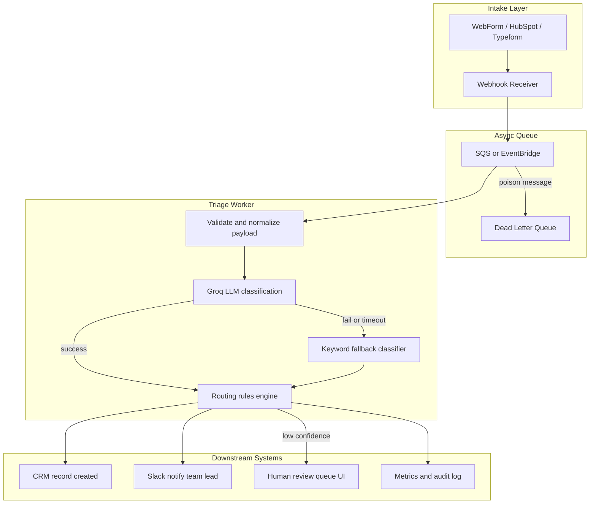

# Intake Triage Agent — Architecture

## Overview

This prototype automates the first step of professional services intake: classifying inbound enquiries by service line and complexity, enriching them with reasoning and tags, and routing them to the appropriate team lead. The design separates **semantic classification** (LLM) from **business routing** (deterministic rules), which keeps the system auditable and override-friendly in production.

## High-Level Data Flow



## Prototype vs Production

| Layer | Prototype (this repo) | Production target |
|-------|----------------------|-------------------|
| Intake | Next.js form UI | HubSpot / Typeform webhook |
| Processing | Synchronous API route | Async worker (Lambda, Cloud Run, or queue consumer) |
| Classification | Groq `llama-3.3-70b-versatile` | Hybrid: fine-tuned classifier for common cases + LLM for edge cases |
| Routing | In-process TypeScript rules | Same rules module, versioned and unit-tested |
| Storage | None (stateless) | Postgres / CRM with audit trail |
| Review | Filtered table in UI | Dedicated review queue with override workflow |

## Model and API Choices

**Groq (prototype):** Fast inference and generous free tier make it ideal for demos and iteration. Structured JSON output with `temperature: 0` gives reproducible classifications. Few-shot examples in the system prompt improve accuracy on ambiguous enquiries.

**Production evolution:**
1. **Phase 1:** Keep Groq/LLM for all enquiries; log every prediction.
2. **Phase 2:** Train a lightweight text classifier (e.g. on labelled historical enquiries) for high-confidence routes; escalate only low-confidence cases to the LLM.
3. **Phase 3:** Active learning loop — human overrides feed back into prompt tuning or fine-tuning.

The LLM should never assign team leads directly. Routing is always computed by [`lib/routing.ts`](../lib/routing.ts) from `serviceLine + complexity + urgency`.

## Integration Points

1. **Web form → webhook:** POST normalized payload `{ description, industry, companySize, urgency, sourceId }`.
2. **Triage worker → CRM:** Create or update a lead/opportunity with classification fields and assigned owner.
3. **Triage worker → Slack/email:** Notify assigned team lead with summary, confidence, and SLA deadline.
4. **Review queue → CRM:** When routed to `intake-review@firm.com`, create a task for the intake analyst with the LLM reasoning attached.
5. **Override capture:** When a human changes service line or team lead, log `{ enquiryId, original, corrected, reviewerId, timestamp }` for model improvement.

## Instrumentation (Day One)

| Metric | Purpose |
|--------|---------|
| `triage.latency.p95` | Detect LLM slowdowns or timeouts |
| `triage.confidence.histogram` | Calibrate review thresholds |
| `triage.review_queue.rate` | Capacity planning for manual review |
| `triage.override.rate` | Primary model quality signal |
| `triage.fallback.rate` | LLM reliability / availability |
| `triage.sla_miss.rate_by_route` | Routing rule effectiveness |
| `triage.source.breakdown` | llm vs fallback vs manual_review |

**Structured logs** should include: `enquiryId`, `serviceLine`, `complexity`, `confidence`, `assignedTeamLead`, `source`, `needsHumanReview`, `latencyMs`.

**Alerts:**
- Fallback rate > 5% over 15 minutes
- Review queue depth > 20 items
- Override rate > 25% for any service line (signals prompt drift or bad rules)

## Security and Compliance

- PII in enquiry text must be encrypted at rest and redacted from model logs where possible.
- API keys (Groq) stored in secrets manager, not environment files in production.
- Audit trail retained for regulatory or client dispute resolution.

## Deployment Topology

```
[Vercel / CloudFront]  →  Next.js UI + API routes (prototype)
[Production]
  API Gateway  →  Lambda/ECS worker  →  Groq API
                →  RDS (enquiries, audit)
                →  SQS (async buffer)
                →  Slack / CRM webhooks
```

The core triage logic in `lib/` is framework-agnostic and can be extracted into a shared package used by both the API route and a standalone worker.
